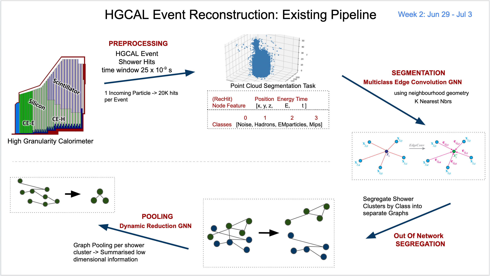
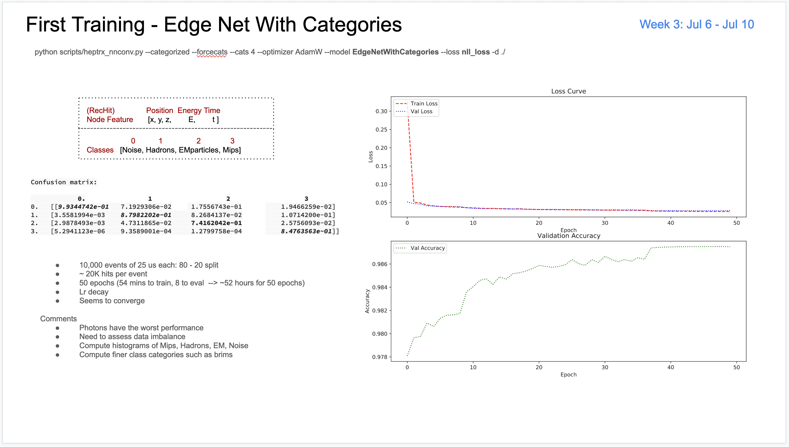

## HGCal Recostruction

ML based Reconstruction for HgCal Data. A tracker for work done at Ferrmilabs.\
[Presentation](https://docs.google.com/presentation/d/1WW9HBwumZRxsq518BsyRxTFi64VcT6rng09rtjOeNRk/edit?usp=sharing)
[Code](https://github.com/chhavisharma/hgcal_ldrd/tree/gravnet2_wip_trainer_args)

### Index
- [Summary](https://github.com/chhavisharma/hgcal-reco/blob/master/README.md#summary)
- [Tentative Roadmap](https://github.com/chhavisharma/hgcal-reco/blob/master/README.md#tentative-roadmap)
- [Week Jun 29 - Jul 3](https://github.com/chhavisharma/hgcal-reco/blob/master/README.md#week-jun-29---jul-3)
- [Week Jun 6  - Jul 10](https://github.com/chhavisharma/hgcal-reco/blob/master/README.md#week-jul-6---jul-10)
- [Week Jun 13 - Jul 17](https://github.com/chhavisharma/hgcal-reco/blob/master/README.md#week-jun-13---jul-17)
- [Resources and References](https://github.com/chhavisharma/hgcal-reco/blob/master/README.md#resources-and-references)

<!---
### Execution
* Author: [Chhavi Sharma](https://www.linkedin.com/in/chhavi275/)
* Tested on: *TBD*
* Installation Instructions: *TBD*
* Execution Instructions: *TBD*
-->

### Summary 
An attempt to learn algorithms that group detector signatures from the same particle together, and, synthesize it into physically meaningful quantities  facilitating the study of the properties of LHC particle collisions in the [CMS](https://home.cern/science/experiments/cms) High-Granularity Calorimeter.

The [High Granularity Calorimeter](https://cms.cern/news/new-era-calorimetry) is used to record particle hits as they flow/ disintegrate/ shower through the it from the LHC. [Calorimetry](https://cms.cern/news/new-era-calorimetry) - the process of measuring the amount of heat released or absorbed during a chemical reaction - is used to record a particle's signature at each hit through the HgCal layers. The amount of energy lost along with timestap and exact spatial coordinates are recorded which detail out the evolution of the showers. 

An attemp needs to be made to reduce the computation and memory requirements of the reconstruction algorithm along with imporving accuracy and discrimination capability. Little is known about how we would reconstruct (hypothetical/ new!) non-standard model particles that make weird signatures in the calorimeter, so highlighting the non-confirming particles/hits as a seperate class in the learning algorithm would also be an interesting capability.

Ground-truth-labelling: An event consists of a collection of hits over a 25 ns window. Each event is considered as a data sample unit and could have upto 20k particle hits.\
EdgeNet: ...\
Union-find Segregation: ...\
Dynamic Reduction Net: ... 

_________________________________________________________________________________________________

### Tentative Roadmap

- Complete retraining of the pipeline
    - Setup Google Cloud VM
        - Transition to Pytorch 1.5.1 and CUDA 10.2 and corresponding pytorch geometric verison
    - Understand existing pipleine
        - Breakdown data preprocessing and compute statistics
        - Retrain the entire pipline - EdgeNet and Dynamic Reduction Net
    
- Optimize Existing Pipeline
    - Hyperparameter optimization for Segmentation (EdgeNet) and Pooling (Dynamic Reduction Net)
        - Optimal Neighbours for Graph CNN Accumulation
        - Optimal number of Pooling Layers
        - Mean pool v/s Avg Pool 

- Explore Alternate Reconstruction Methods
    - End-to-end gradient flow with the current pipeline 
        - Infuse graph Segregation in the deep network for gradient flow from Reduction all the way to Segmentation
    - Energy Regression
        - Attention/ transformer based single shot GNN
        - Draw from Object Condensation (by Jan K.)
        - ASAP - Supervised clustering without a limit on K

_________________________________________________________________________________________________

### Weekly Tracking

##### Week Jun 29 - Jul 3
 
Exisitng Pipeline: Graph Neural Networks are used to model raw HGCal data into particle shower clusters in these 4 categories.
  - 0 Noise
  - 1 Hadrons: ...
  - 2 EM Particles: ...
  - 3 Mips: ...

 Existing Pipeline 

  

  

_________________________________________________________________________________________________

##### Week Jul 6 - Jul 10

Re-training EdgeNet
Re-training Dynamic Reduction Net

 Existing Pipeline 

  

  

_________________________________________________________________________________________________

##### Week Jul 13 - Jul 17

Hyperparameter Tuning
Optimal Neighbours for Graph CNN Accumulation
Optimal number of Pooling Layers
Mean pool v/s Avg Pool 

_________________________________________________________________________________________________

##### Week Jul 20 - Jul 24

Paper Discussion - [ASAP](https://arxiv.org/abs/1911.07979) with [MultiLabelMarginLoss](https://pytorch.org/docs/stable/nn.html#multilabelmarginloss)

_________________________________________________________________________________________________

### Resources and References 
0. The standard Model https://home.cern/science/physics/standard-model 
1. GNN Papers: 
    - The "paper" [https://arxiv.org/abs/1611.08097](https://arxiv.org/abs/1611.08097)
    - Review paper: [https://arxiv.org/abs/1812.08434](https://arxiv.org/abs/1812.08434)
    - Networks typically used:
      - https://arxiv.org/abs/1612.00222 
      - https://arxiv.org/abs/1801.07829  
      - https://arxiv.org/abs/1902.07987 
      - https://arxiv.org/abs/2003.08013  
    - An interesting specialized loss - OBJECT CONDENSATION https://arxiv.org/abs/2002.03605 
    - More specific example papers- Graph Neural Networks for Particle Reconstruction in High Energy Physics detectors https://arxiv.org/abs/2003.11603 
    - Some interesting directions to go:
      - Covariant Compositional Networks For Learning Graphs https://arxiv.org/abs/1801.02144      
      - ASAP: Adaptive Structure Aware Pooling for Learning Hierarchical GraphRepresentations https://arxiv.org/abs/1911.07979 
    - Juniper (Dianna's Suggestion) Binary Junipr achieves state-of-the-art performancefor quark/gluon discrimination and top-tagging. https://arxiv.org/pdf/1906.10137.pdf
2. Deployment:
    - https://docs.nvidia.com/deeplearning/triton-inference-server/user-guide/docs/ 
    - https://github.com/rusty1s/pytorch_geometric/pull/1191
